In this tutorial, we will use [this tileset](https://www.kenney.nl/assets/abstract-platformer) by [@KenneyNL](https://twitter.com/KenneyNL) to create basic platformer levels. Be sure to check their work out if you like the tileset. We will not care about room decorations very much - the goal of this tutorial is to demonstrate all the basic steps needed to create platformer levels.

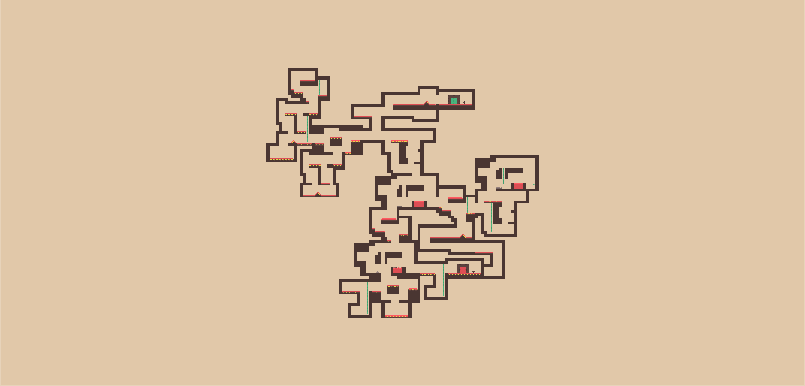
*Example result*

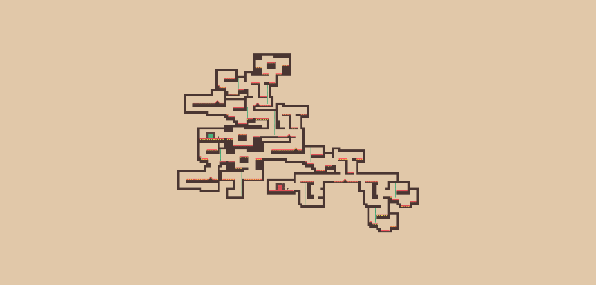
*Example result*

> **Note:** Platformers support is **very experimental** and not that much tested. The goal was to create a simple prototype and improve that in the future.

> **Note:** I recommend reading [Example 1](example1.md) first as this is a little bit harder to setup and I will not repeat the basics here.

> **Note:** All files from this example can be found at *ProceduralLevelGenerator/Examples/Platformers*.

## Limitations

Only **acyclic** level graphs **without corridors** are currently supported.

## Setup

### Platformer generator

A different pipeline task is needed to create platformer levels. It is called **Platformer Generator** and can be found at *DungeonGenerator/Generators/Platformer generator*. Its config is the same as of the *GraphBasedGenerator*.

### Room templates

Below you can see a few of the room templates that were created for this example. I decided to use the same length for all doors but it would be also possible to e.g. have vertical doors with a different length as we may need less space for vertical movement. To make generated levels feel less repetetive, the goal is to provide as many possible door positions as possible.

To make the room templates usable in real-life scenarios, we have to assure that it is possible to successfully traverse generated levels without being stuck at dead-ends caused by impossible jumps. There are possibly several ways to handle that:
- We can design the room templates so that all possible connections are viable.
- We can apply some postprocessing to add e.g. ropes if we detect dead-ends after a level is generated.
- We can tell the algorithm which connections are viable and which are not. However, this is currently not possible as this whole *platformer* feature is very experimental.

> **Note:** The term *doors* is used throughout the text but in this context it simply means a conection between two rooms.

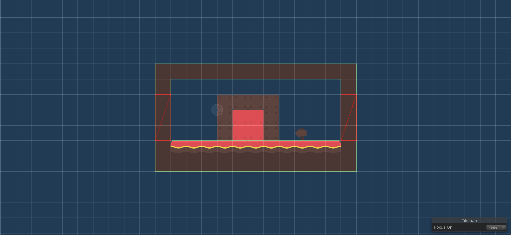
*Start*

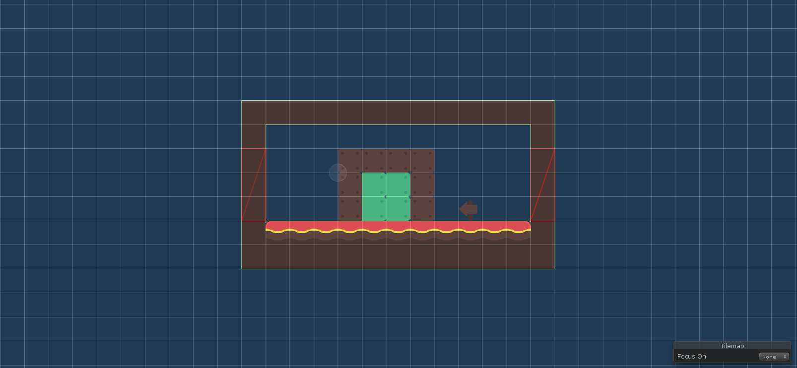
*Goal*

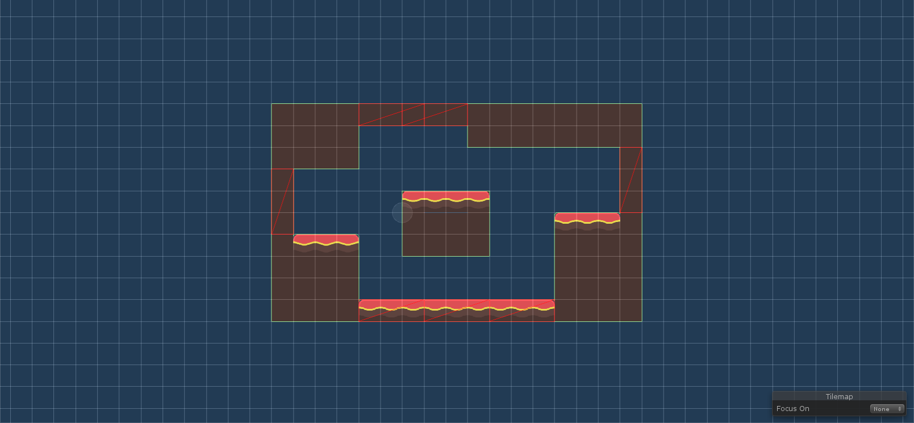
*Basic room*

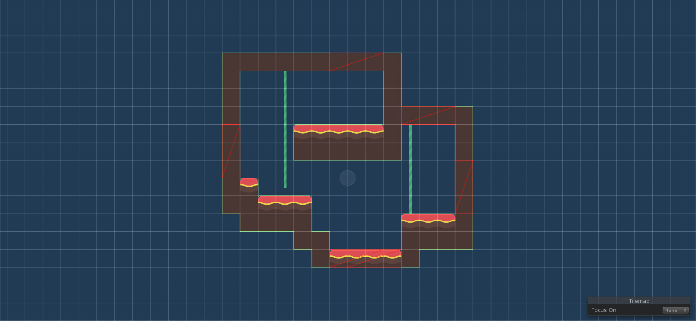
*Basic room*

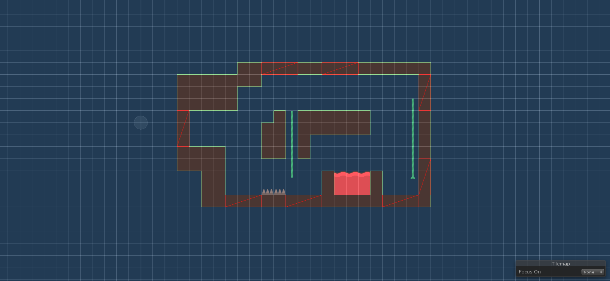
*Basic room*

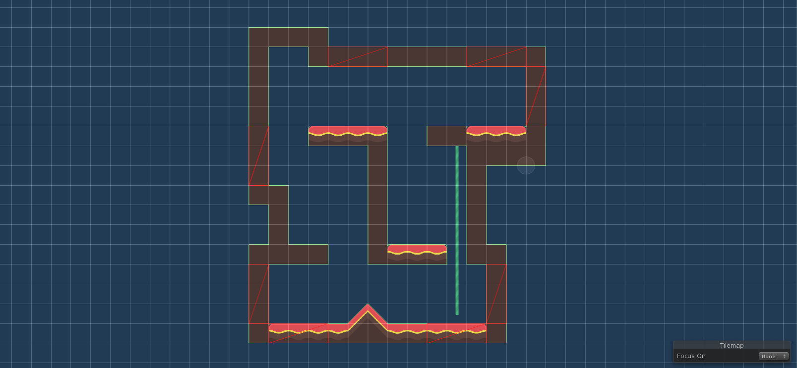
*Basic room*

### Level graph

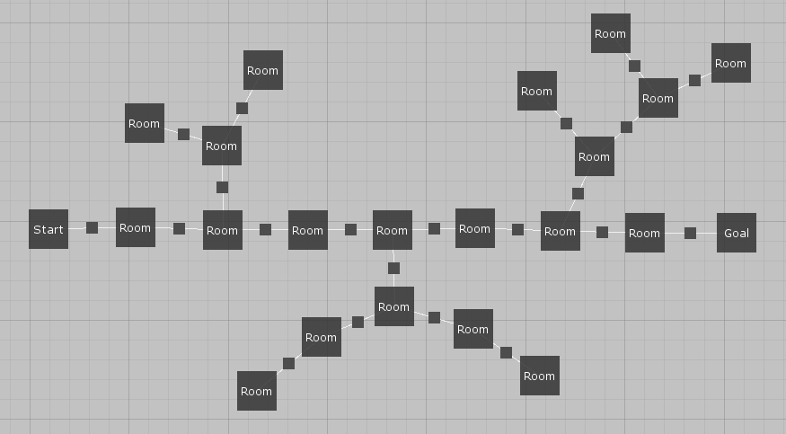
*Level graph*

### Results

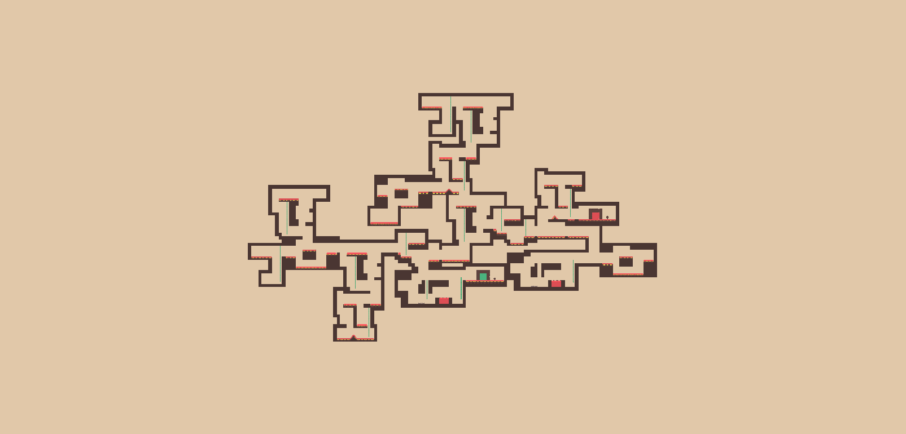
*Example result*

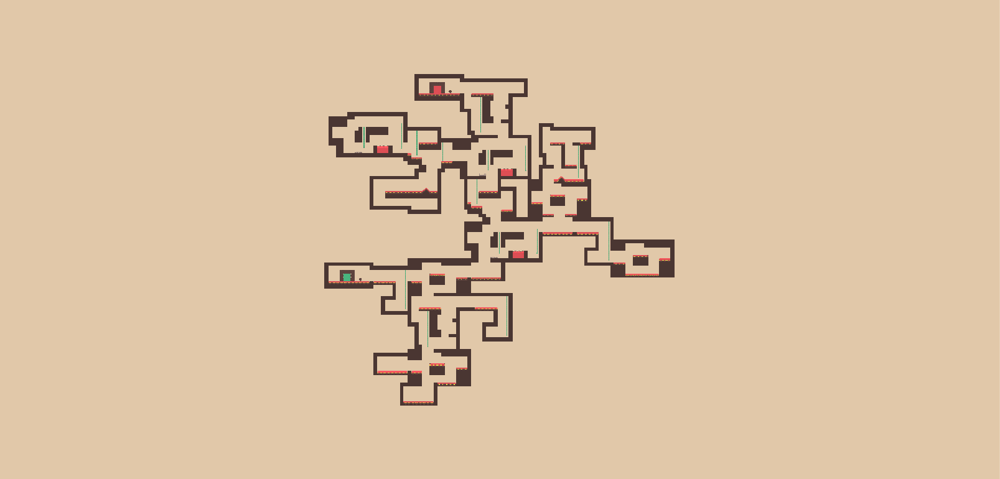
*Example result*

