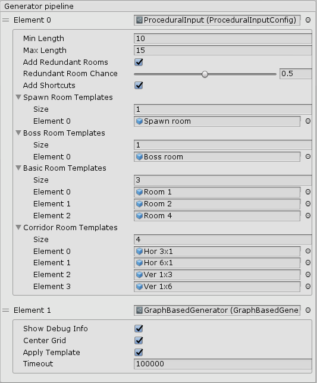
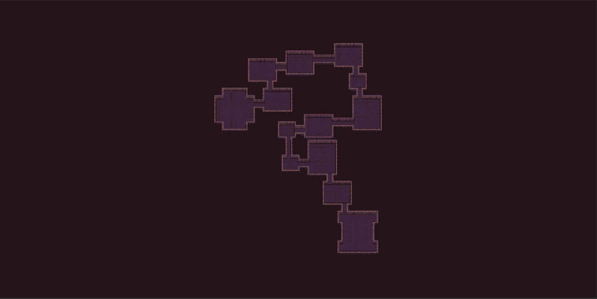
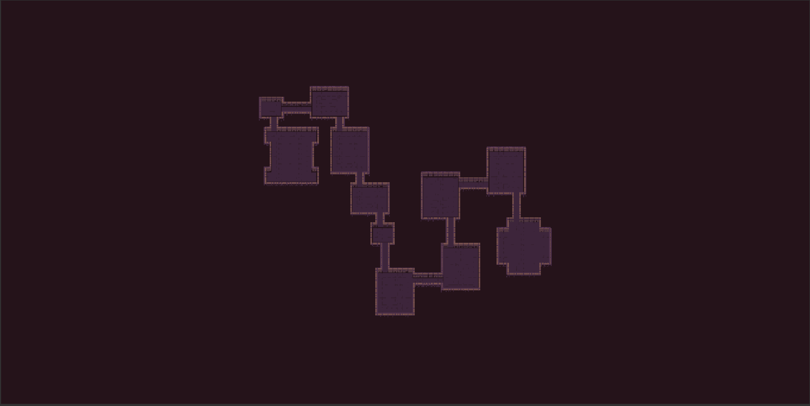
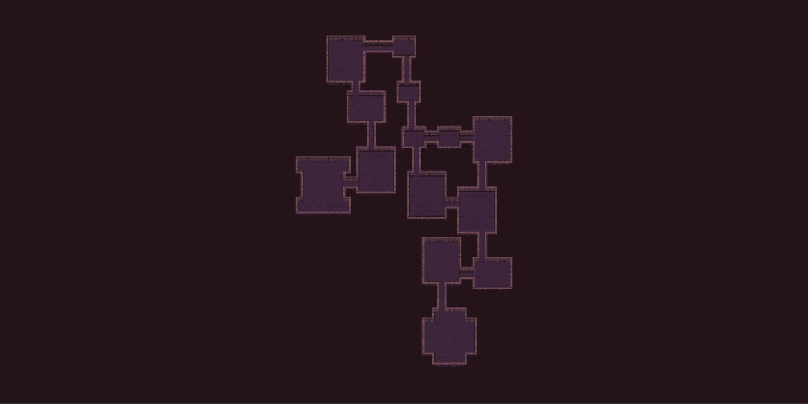
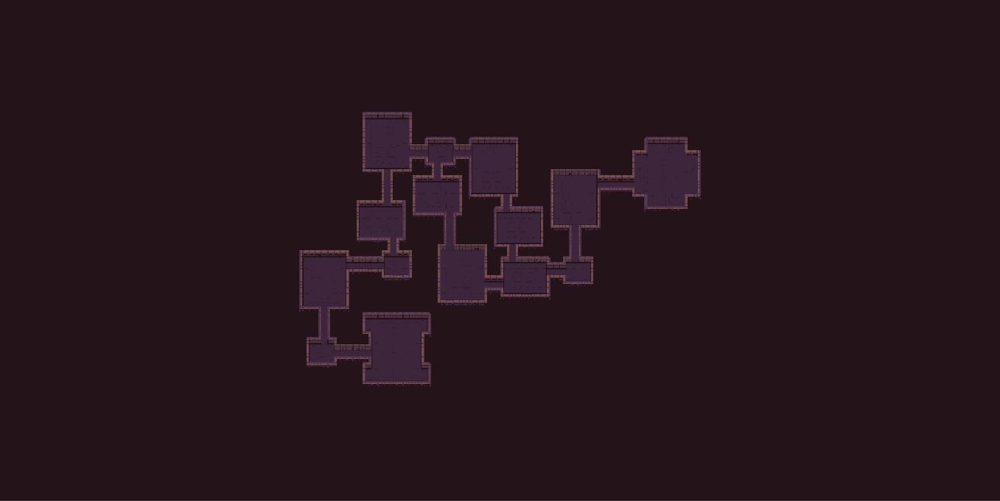
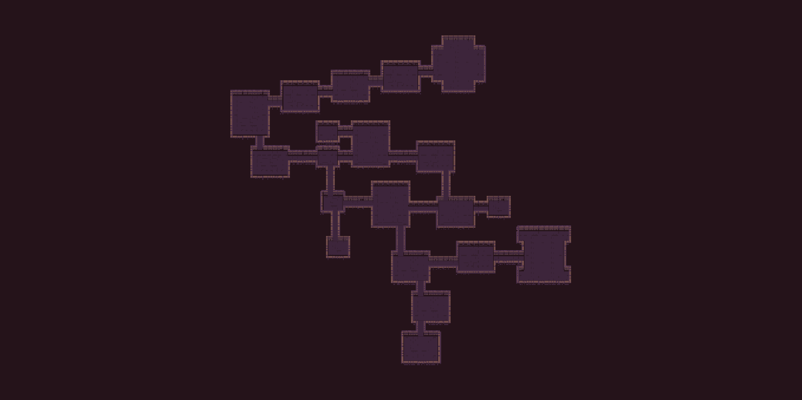
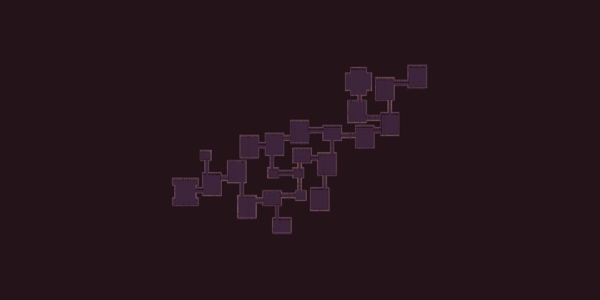

The goal of this tutorial is to show you one possible approach to generating procedural level graphs. I will not try to show how to generate interesting level graphs but rather describe what needs to be done in general.

## Goal

#### Main path

We will start with a simple path from the spawn room to the boss room. This path is called the *main path* in the source code. We will choose the number of rooms on the main path randomly from a predefined range.

#### Shortcut

We will add a shortcut from a randomly chosen room on the main path to another randomly chosen room. In other words, there will be one cycle in the level graph.

#### Redundant rooms

We will randomly choose rooms on the main path or on the shortcut and connect one or two new rooms that will not lead to the boss room but rather make the dungeon more non-linear.

## Implementation

The implementation together with documentation comments and an example scene can be found [here](https://github.com/OndrejNepozitek/ProceduralLevelGenerator-Unity/tree/master/Assets/ProceduralLevelGenerator/Examples/ProceduralLevelGraphs).

#### `Room` and `RoomType` classes

The default input task (`FixedInputTask`) works with a room class that is used in GUI and is not very suitable for our usecase. Therefore I prepared a custom class that will hold information about our rooms and also an enum that codes several types of rooms. The two types are currently very simple but can be extended to carry more information.

```csharp
/// <summary>
/// Custom room type.
/// </summary>
public class Room
{
    public RoomType Type { get; set; }
}
```

```csharp
/// <summary>
/// Type of room.
/// </summary>
public enum RoomType
{
    Basic, Spawn, Boss, Redundant, Shortcut
}
```

#### Custom payload initializer

Because we have a custom room type, we need a payload initializer that returns a payload that works with our room type. Its implementation is very simple. We inherit from the base payload initializer and return a payload specialized for our room type.

```csharp
[CreateAssetMenu(menuName = "Dungeon generator/Examples/Procedural level graphs/Payload initializer", fileName = "PayloadInitializer")]
public class CustomPayloadInitializer : PayloadInitializer
{
    public override object InitializePayload()
    {
        return InitializePayload<Room>();
    }
}
```

We must not forget to use this payload initializer when we setup the generator pipeline script.

#### Task config



## Performance

The algorithm is sometimes unable to generate a dungeon under 10 seconds, which is the default timeout period. In this particular example, it is probably because:

- We have too few room templates
- We accidentally made the level graph too complex
- The underlying algorithm needs performance improvements

## Results

<div class="two-columns">
<div>


*Only main path*

</div>
<div>


*Only main path*

</div>
</div>

<div class="two-columns">
<div>


*With a shortcut*

</div>
<div>


*With a shortcut*

</div>
</div>

<div class="two-columns">
<div>


*With redundant rooms*

</div>
<div>


*With redundant rooms*

</div>
</div>